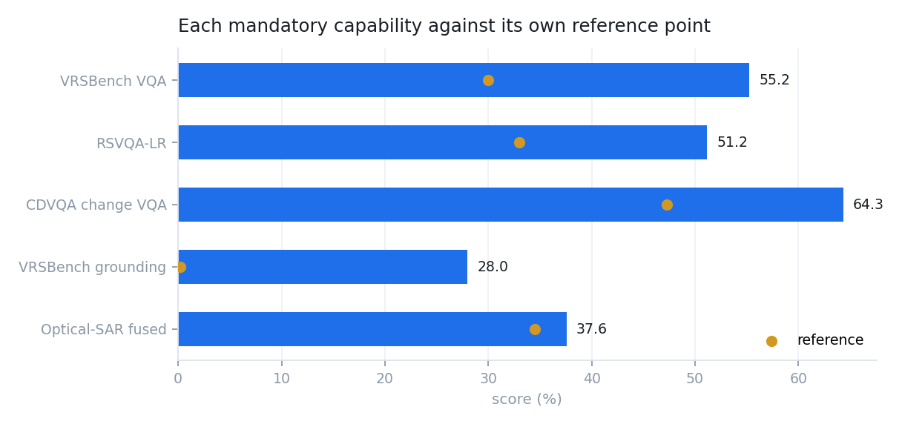
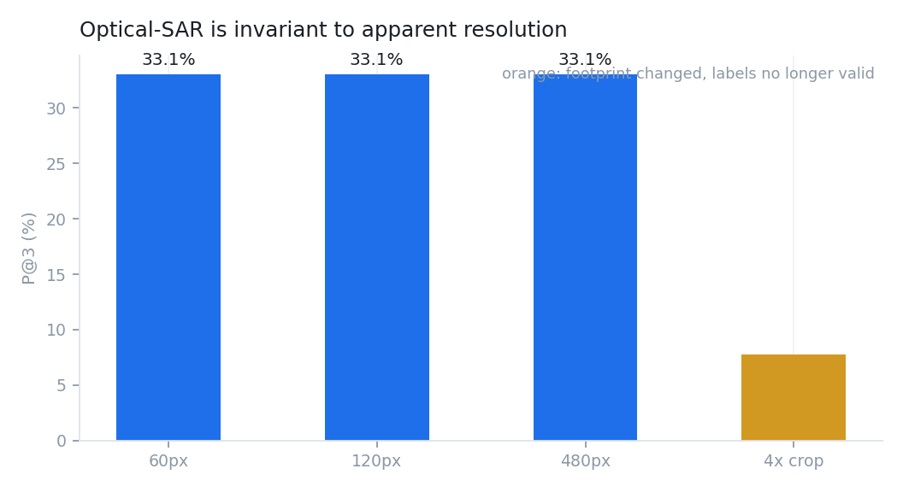

# Conformance to SIH26167

Every mandatory clause of the problem statement, quoted, with where it is
implemented and how it was checked. Clauses not yet met are listed as gaps
rather than omitted.

## Defined input scope

| Required | Status | Where |
|---|---|---|
| Single image — optical/multispectral or SAR | met | `io/inspect.py` → `InputKind.SINGLE` |
| Cross-modal pair — co-registered optical + SAR | met | `InputKind.CROSS_MODAL_PAIR`, `tools/multi_image.py` |
| Bi-temporal pair — two dates, same area | met | `InputKind.BI_TEMPORAL_PAIR`, `ChangeTool` |
| GeoTIFF/TIFF for geospatial imagery | met | `_open()` reads bands 4/3/2 via rasterio |
| PNG/JPEG "only for the prescribed public benchmark datasets" | met | accepted, and flagged in the trace as non-geospatial |

## Mandatory functional scope

> "At least one visual or vision-language component must be fine-tuned or
> otherwise adapted using BigEarthNet.txt or the any open source training data."

Met, and measured. CLIP fine-tuned contrastively on 2,182 BigEarthNet.txt
image–caption pairs, evaluated on 386 held-out patches split by patch so no
scene appears in both halves:

| metric | before | after |
|---|---|---|
| zero-shot land-cover top-1 | 2.1% | **45.8%** |
| image→text R@5 | 1.8% | **28.5%** |
| text→image R@10 | 2.8% | **44.0%** |

> "Visual question answering shall be mandatory. Each solution must
> additionally implement either captioning/scene description or text-guided
> region grounding."

Met, with both rather than either, and by more than one specialist each: `VQATool` and `GenerativeTool` for VQA, `CaptionTool` and `GenerativeTool` for captioning, `GroundingTool` and `DetectionTool` for grounding. The controller selects between them per query.

> "Change description or change-based visual question answering from a
> bi-temporal image pair shall be mandatory. A spatial change map may also be
> generated."

Met, with both tasks and the optional change map: `ChangeTool` returns a
`change_map` evidence item alongside boxes and per-class deltas.

> "The system must extract complementary information from a co-registered
> optical/multispectral and SAR image pair."

Met: `CrossModalTool` reads each modality for what it is good at
(`SAR_STRENGTHS` / `OPTICAL_STRENGTHS`) and reports an agreement score, rather
than stacking the two images through one model.

> "The system must automatically select, sequence, and execute the appropriate
> specialist models or tools according to the query and input configuration."

Met: `controller/agent.py`.

## The controller's six enumerated steps

The statement enumerates six; `Controller.run()` implements them in order, and
each is observable in the returned trace.

| # | Required | Implementation |
|---|---|---|
| 1 | interpret the query and classify the requested task | `router.classify()` |
| 2 | check number, modality, format, metadata, compatibility | `inspect_image()`, `classify_inputs()` |
| 3 | select one or more tools from a predefined registry | `Registry.for_task()`, `_plan()` |
| 4 | configure **only permitted** task parameters | `Tool.filter_params()`; dropped names recorded in the trace |
| 5 | combine outputs, estimate confidence, return visual evidence | `_fuse()`, `_confidence()`, `Evidence` |
| 6 | provide an auditable execution summary | `Trace`, returned on every request |

Step 4 is enforced structurally, not by convention: a tool declares `accepts`
in its `ToolSpec` and `invoke()` filters before dispatch, so a tool cannot
receive a parameter it never declared even if the caller sends one.

> "only the observable execution trace … will be evaluated. Internal reasoning
> text is neither required nor evaluated."

The trace carries the task, tool names, permitted parameters, timings, and
outcomes. No internal reasoning text is emitted.

## Representative queries

All five quoted in the statement route correctly, and are conformance tests in
`tests/test_router.py::TestProblemStatementQueries`.

| Query | Routes to |
|---|---|
| "Describe the land-cover and major objects visible in this image." | `caption` |
| "Highlight the water body referred to in the query." | `grounding` |
| "What changed between these two dates, and where did the change occur?" | `change_description` |
| "Use the optical and SAR images together to identify built-up and water-covered regions." | `cross_modal` |
| "Has the built-up area increased, decreased, or remained unchanged?" | `change_vqa` |

The third failed until tested: it contains "did … change" and was read as a
polar question, dispatching change VQA. Paraphrasing the statement's queries
would have hidden that.

## Expected solution

> "an interactive GUI or web application with an agentic remote-sensing AI backend"

Met: `satquery/server.py` + `web/index.html`.

| "The solution should include" | Status |
|---|---|
| Input upload and compatibility checking | met |
| A remote-sensing-adapted vision-language component | met, measured above |
| Specialist tools for VQA, captioning or grounding, change, optical–SAR | met, seven tools |
| An agentic controller for routing, execution, integration | met |
| Visual evidence | met — boxes, heat maps, change maps |
| Confidence information | met — per-tool and aggregate |
| Execution summaries | met — full trace on every request |
| Downloadable reports | met — self-contained HTML and JSON |

> "A generic LLM or VLM without remote-sensing adaptation will not satisfy the
> requirements."

Directly evidenced. Stock OpenAI CLIP scores 8.3% zero-shot land-cover on these
patches and RemoteCLIP 2.1%, both far below the 49.0% majority-class baseline.
Adaptation is what makes the system work, not a refinement on top of one that
already did.

## Benchmark results

Measured, not asserted. Full breakdown with baselines in [BENCHMARKS.md](BENCHMARKS.md).

| benchmark | scope | result |
|---|---|---|
| Optical–SAR pairs | cross-modal (mandatory) | fused **37.6%** P@3, **+1.4** over the better single sensor |
| CDVQA | change VQA (mandatory) | **64.3%** over 300 questions |
| RSVQA-LR | single-image VQA | **51.2%** over 600; scene-level 70.6% |
| VRSBench VQA | single-image VQA | **55.2%** exact / 59.2% lenient over 1,200 |
| VRSBench grounding | text-guided grounding | **28.0%** Acc@0.5 IoU |
| VRSBench captioning | scene description | ROUGE-L **0.306**, BLEU-1 0.280 |

Every number comes from the real serving path, the registered tool invoked
through `Tool.invoke`.

Two of these are strong for a system with no task-specific training: change
direction (74.1% increase, 65.7% decrease) and optical–SAR fusion, which is
complementary in the measurable sense that fusing beats either sensor alone.
The rest are weak, and the reasons are structural rather than tuning problems.

## Resolution is not the ISRO risk

The graded set is Cartosat-2S optical and RISAT SAR — sub-metre against the
10 m/px Sentinel-2 this was adapted on, which looked like the same distribution
shift that has caught this project at every previous stage.

Tested by changing apparent resolution across an eightfold range while holding
footprint and labels fixed: P@3 is 33.1% at 60 px, 120 px and 480 px alike.
Identical to three figures, which is what the architecture predicts — the
processor resamples every input to 224×224, so apparent resolution is
normalised away before the encoder sees it.

A first version of that experiment cropped instead of rescaling and reported a
collapse from 33.1% to 7.8%, concluding the model was resolution-sensitive.
That was an artefact: cropping to a sixteenth of the area also invalidates
labels that describe the whole patch. The corrected experiment is in
`eval/crossmodal_robustness.py`, which keeps the confounded variant alongside
the valid one so the contrast is visible.

What remains genuinely untested is sensor character — RISAT's speckle,
incidence angle and polarimetry against Sentinel-1's — and scene content at a
much smaller ground footprint. Neither is testable without the data, and
neither is claimed either way.

## Gaps

Open, and stated rather than glossed:

- **Object-level questions are addressed but weak.** An open-vocabulary
  detector now serves them, which moved grounding from 0.2% to 25.1% and
  counting from nothing to 21.2%. Most VRSBench object types still sit below
  their majority baselines, so this is a working capability rather than a
  strong one.
- **Attribute questions are the weakest.** Colour is read as the mean pixel
  value inside a box and direction is not modelled at all; both score near
  zero. A finer attribute head would be the next addition.
- **Detection recall limits grounding.** 192 of 800 referring expressions
  produce no box at all even at a 0.03 threshold, which caps Acc@0.5 well below
  what the resolver could otherwise reach.
- **Captioning is a vocabulary mismatch.** A 21-class land-cover summary against
  long human descriptions of vehicles and colours. The metrics measure a
  difference in kind.
- **Cross-corpus transfer is weak.** Adaptation on BigEarthNet's CORINE
  vocabulary does not carry to RSVQA's object-centric annotation even on the
  same sensor family; rules that answer "yes" often score *below* chance there.
- **The shipped checkpoint costs RSVQA accuracy.** 34.9% against the
  optical-only checkpoint's 37.1% on the same questions. Taken deliberately,
  because optical–SAR is mandatory and does not work without it.
- **Zero-shot land-cover sits near the majority baseline** on a subset dominated
  by one class. The baseline is a degenerate classifier and ours discriminates
  21, but the gap is real and is not presented as a win.
